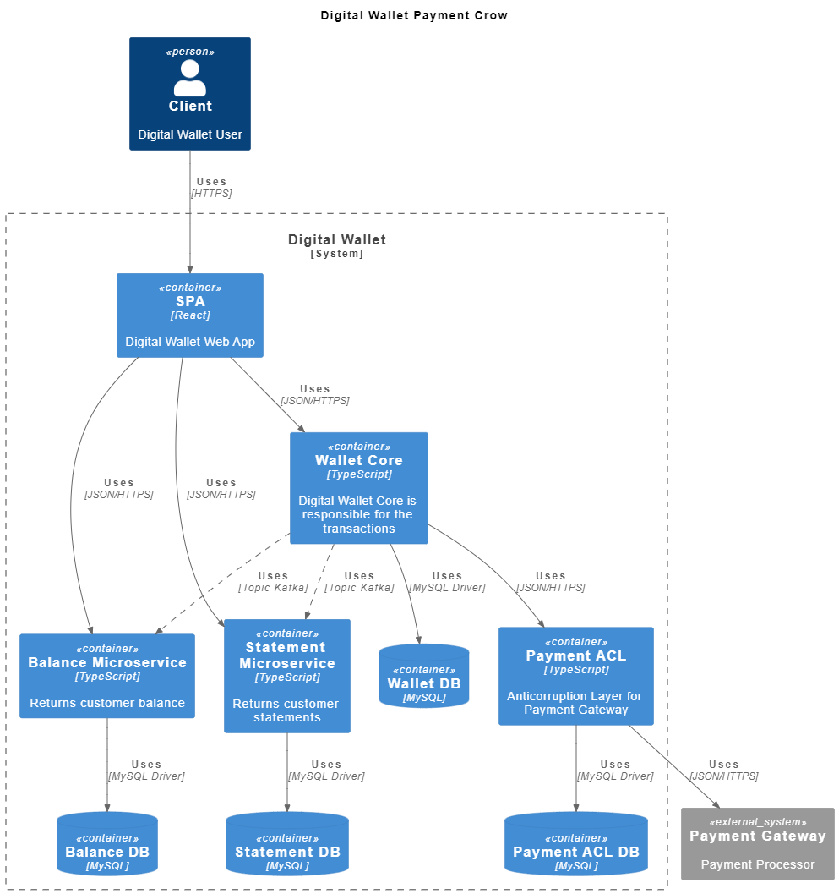

# microservices-based-architecture

# Criando uma arquitetura de micro serviço utlizando diagrama C4Model.

# Tecnologias Utilizadas

    - Java 8
    - Exetação do vscode: PlantUML
    - Graphviz

# Documentação C4 Model

    - https://github.com/plantuml-stdlib/C4-PlantUML

# Para aplicar uma pré visualização do project

    - comando: ctrl + shift + p
        - plantUML: Preview Current Diagram

# Arquitetura Principal do Projeto

    
